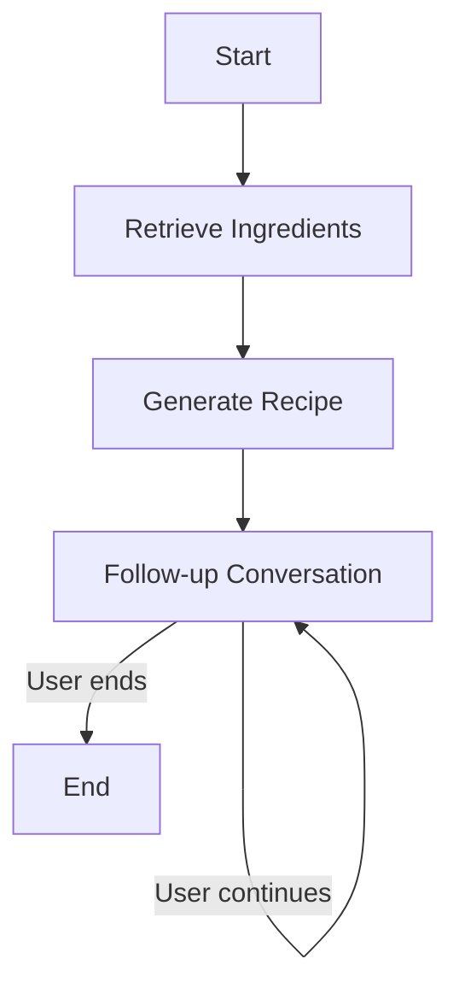

# 🥦 Zero-Waste Grocery Helper

**A conversational AI assistant that helps you generate creative, zero-waste recipes using the ingredients you already have.**

Built using [LangGraph](https://github.com/langchain-ai/langgraph), [Streamlit](https://streamlit.io/), and [FAISS](https://github.com/facebookresearch/faiss) for a fast, interactive user experience.

---

## 🚀 Features

* ♻️ **Zero-waste cooking assistant** that suggests recipes based on your available ingredients.
* 📚 **Semantic recipe search** using FAISS vectorstore with HuggingFace sentence embeddings.
* 💬 **Conversational flow** powered by LangGraph state machines.
* 🔁 **Follow-up interaction** to continue chatting about the recipe or ask for variations.
* ⚡️ **Fast and interactive UI** built with Streamlit.

---

## 🛠️ How It Works

### Graph Flow



1. **Retrieve**: Search relevant recipes using a vector database.
2. **Generate**: Craft a creative zero-waste recipe using an LLM.
3. **Follow-up**: Continue conversation based on recipe context and chat history.

---

## 🧩 Tech Stack

| Component     | Tech Used                                          |
| ------------- | -------------------------------------------------- |
| UI            | Streamlit                                          |
| State Machine | LangGraph (LangChain)                              |
| LLM           | Groq API using LLaMA 4 Scout 17B                   |
| Embeddings    | HuggingFace `all-MiniLM-L6-v2`                     |
| Vector Search | FAISS                                              |
| Data          | `recipes.txt` (your custom zero-waste recipe base) |

---

## 🧱 Project Structure

```
.
├── langgraph_app.py         # Main LangGraph app
├── streamlit_app.py         # Streamlit interface
├── recipes.txt              # Corpus of recipes
├── requirements.txt
└── README.md
```

---

## 🖥️ Run Locally

### 1. Clone the repository

```bash
git clone https://github.com/shreyanshknayak/zero-waste-grocery-helper.git
cd zero-waste-grocery-helper
```

### 2. Install dependencies

```bash
pip install -r requirements.txt
```

### 3. Set your Groq API key

Set your key in `langgraph_app.py` or export it as an environment variable:

```bash
export GROQ_API_KEY="your-key-here"
```

### 4. Start the app

```bash
streamlit run streamlit_app.py
```

---

## 🧪 Example Prompts

> "I have tomatoes, onions, garlic, and stale bread. What can I make?"

> "Can you make it gluten-free?"

> "Give me a zero-waste variation without using an oven."

---

## ✅ To-Do

* [ ] Add image-based ingredient recognition (CV integration)
* [ ] Save user sessions and recipes
* [ ] Deploy to Streamlit Cloud
* [ ] Add voice interface

---

## 📄 License

This project is licensed under the MIT License.

---

## 🧠 Acknowledgments

* [LangGraph](https://github.com/langchain-ai/langgraph)
* [FAISS](https://github.com/facebookresearch/faiss)
* [Groq LLMs](https://console.groq.com/)
* [Streamlit](https://streamlit.io)


